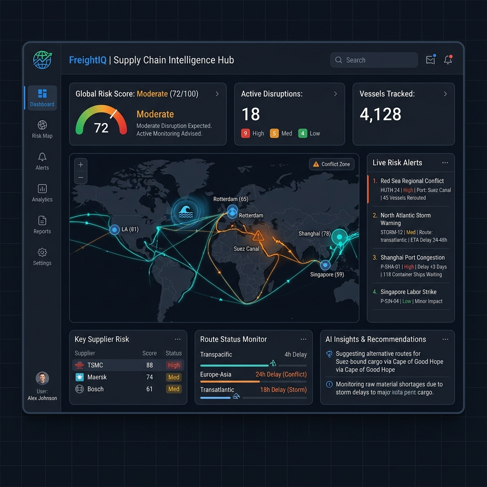
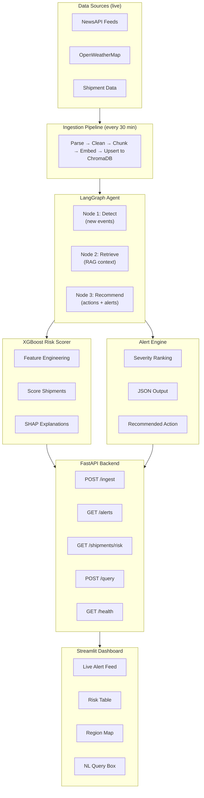

# FreightIQ

**AI-powered supply chain disruption detection, shipment risk scoring, and automated alerts**

     

---

## Table of Contents

- [What It Does](#what-it-does)
- [Quick Start](#quick-start)
- [Architecture](#architecture)
- [Tech Stack](#tech-stack)
- [Project Structure](#project-structure)
- [Getting Started](#getting-started)
- [Core Modules](#core-modules)
- [Model Training](#model-training)
- [Deployment](#deployment)
- [Configuration](#configuration)
- [Troubleshooting](#troubleshooting)
- [Roadmap](#roadmap)
- [Business Value](#business-value)
- [Contributing](#contributing)
- [About](#about)
- [License](#license)

---

## What It Does

FreightIQ is an agentic AI system that:

- **Monitors** global news feeds and weather APIs in real time for supply chain disruption signals
- **Retrieves** relevant historical context using a RAG pipeline over your shipment and disruption knowledge base
- **Scores** each affected shipment for delay/disruption risk using a trained XGBoost model
- **Generates** structured alerts with recommended actions per shipment
- **Displays** everything on a live Streamlit dashboard with natural language querying

> Demo prompt: *"Port of Rotterdam strike reported — which of our shipments are at risk and what should we do?"*
> The system detects the event, retrieves related context, scores affected shipments, and outputs a ranked action list — automatically.

<!-- TODO: Add a screenshot or GIF of the Streamlit dashboard here -->
<!--  -->

---

## Quick Start

```bash
git clone https://github.com/rajan0860/freightiq.git
cd freightiq
pip install -r requirements.txt
cp .env.example .env          # Add your API keys
python scripts/generate_data.py
python scripts/train_model.py
streamlit run src/dashboard/app.py
```

> **Note:** The `streamlit run` command must be run from the project root so that relative imports and data paths resolve correctly.

> See [Getting Started](#getting-started) for the full step-by-step walkthrough.

---

## Architecture



---

## Tech Stack

| Layer | Technology |
|---|---|
| Language | Python 3.10+ |
| RAG / Agents | LangChain, LangGraph |
| Vector store | ChromaDB |
| LLM | OpenAI GPT-4o / Claude 3.5 Sonnet |
| ML scoring | XGBoost, scikit-learn, SHAP |
| Data feeds | NewsAPI, OpenWeatherMap API |
| Data generation | Faker, pandas |
| PDF ingestion | pdfplumber, PyPDFLoader |
| Backend API | FastAPI, Uvicorn |
| Frontend | Streamlit, Plotly |
| Deployment | Docker, Hugging Face Spaces, Render |
| Dev tools | python-dotenv, pydantic, schedule |

---

## Project Structure

```
freightiq/
│
├── data/
│   ├── raw/                        # Raw ingested news + weather
│   ├── processed/                  # Cleaned, chunked documents
│   ├── synthetic/                  # Generated shipment + disruption data
│   └── models/                     # Saved XGBoost model artifacts
│
├── src/
│   ├── ingestion/
│   │   ├── news_fetcher.py         # NewsAPI integration
│   │   ├── weather_fetcher.py      # OpenWeatherMap integration
│   │   ├── pdf_loader.py           # PDF ingestion + chunking
│   │   └── pipeline.py             # Unified ingestion pipeline
│   │
│   ├── rag/
│   │   ├── embeddings.py           # Embedding model setup
│   │   ├── vector_store.py         # ChromaDB setup + upsert
│   │   ├── retriever.py            # Retrieval chain + metadata filters
│   │   └── prompts.py              # System prompts + few-shot templates
│   │
│   ├── ml/
│   │   ├── feature_engineering.py  # Feature creation from shipment data
│   │   ├── train.py                # XGBoost training + evaluation
│   │   ├── scorer.py               # Inference + SHAP explanations
│   │   └── utils.py                # Helpers for ML pipeline
│   │
│   ├── agent/
│   │   ├── graph.py                # LangGraph agent definition
│   │   ├── nodes.py                # Detect / Retrieve / Recommend nodes
│   │   ├── state.py                # Agent state schema (Pydantic)
│   │   └── alerts.py               # Alert formatting + output
│   │
│   ├── api/
│   │   ├── main.py                 # FastAPI app entry point
│   │   ├── routes/
│   │   │   ├── alerts.py           # GET /alerts
│   │   │   ├── shipments.py        # GET /shipments/risk
│   │   │   └── query.py            # POST /query (NL interface)
│   │   └── schemas.py              # Pydantic request/response models
│   │
│   └── dashboard/
│       ├── app.py                  # Streamlit entry point
│       ├── pages/
│       │   ├── alerts.py           # Live alert feed view
│       │   ├── risk_table.py       # Shipment risk table view
│       │   ├── region_map.py       # Disruption map view
│       │   └── query.py            # Natural language query view
│       └── components/             # Reusable UI components
│
├── scripts/
│   ├── generate_data.py            # Synthetic data generation (Faker)
│   ├── ingest_and_run.py           # Manual trigger for agent run
│   └── train_model.py              # One-shot model training script
│
├── tests/
│   ├── test_rag.py
│   ├── test_scorer.py
│   └── test_agent.py
│
├── notebooks/
│   ├── 01_rag_exploration.ipynb    # RAG pipeline experiments
│   └── 02_xgboost_training.ipynb   # Model training walkthrough
│
├── Dockerfile
├── docker-compose.yml
├── requirements.txt
├── .env.example
└── README.md
```

---

## Getting Started

### Prerequisites

- Python 3.10+
- An [OpenAI API key](https://platform.openai.com) (~$10 credit covers full development)
- A free [NewsAPI key](https://newsapi.org)
- A free [OpenWeatherMap API key](https://openweathermap.org/api)

### 1. Clone the repository

```bash
git clone https://github.com/rajan0860/freightiq.git
cd freightiq
```

### 2. Create virtual environment

```bash
python -m venv venv
source venv/bin/activate        # Mac/Linux
venv\Scripts\activate           # Windows
```

### 3. Install dependencies

```bash
pip install -r requirements.txt
```

### 4. Configure environment variables

```bash
cp .env.example .env
```

Edit `.env` and add your keys (see [Configuration](#configuration) for all available options).

### 5. Generate synthetic data

```bash
python scripts/generate_data.py
```

Creates 100 synthetic shipment records and 50 historical disruption events in `data/synthetic/`.

### 6. Train the risk scoring model

```bash
python scripts/train_model.py
```

Saves the trained XGBoost model to `data/models/xgboost_risk.json`.

### 7. Run the ingestion pipeline

```bash
python scripts/ingest_and_run.py
```

Fetches live news + weather, embeds documents into ChromaDB, and runs the agent.

### 8. Start the backend API

```bash
uvicorn src.api.main:app --reload --port 8000
```

API docs: [http://localhost:8000/docs](http://localhost:8000/docs)

### 9. Launch the Streamlit dashboard

```bash
streamlit run src/dashboard/app.py
```

Dashboard: [http://localhost:8501](http://localhost:8501)

---

## Core Modules

### RAG Pipeline

Ingests supply chain documents (news articles, historical disruption reports, shipping route docs) and stores them in ChromaDB with rich metadata for filtered retrieval.

```python
from src.rag.retriever import DisruptionRetriever

retriever = DisruptionRetriever()

results = retriever.query(
    query="port strike affecting container shipping",
    filters={"region": "Europe", "event_type": "labour_dispute"},
    k=5
)
```

### XGBoost Risk Scorer

Scores each shipment on a 0–1 delay probability scale. SHAP values provide human-readable explanations.

```python
from src.ml.scorer import RiskScorer

scorer = RiskScorer.load("data/models/xgboost_risk.json")

result = scorer.score({
    "route": "Shanghai → Rotterdam",
    "carrier_reliability": 0.72,
    "days_to_delivery": 4,
    "region_disruption_count": 3,
    "weather_severity": 0.6
})
# {"risk_score": 0.84, "risk_level": "HIGH",
#  "explanation": "High disruption count in region (+0.31), low carrier reliability (+0.18)"}
```

### LangGraph Agent

A three-node agent (Detect → Retrieve → Recommend) that runs on a schedule and produces structured alerts.

```python
from src.agent.graph import DisruptionAgent

agent = DisruptionAgent()
alerts = agent.run()

# Returns list of Alert objects:
# {
#   "event": "Rotterdam port workers strike — day 3",
#   "severity": "HIGH",
#   "affected_shipments": ["SHP-1042", "SHP-1087", "SHP-1103"],
#   "recommended_action": "Contact carrier DHL Express to reroute via Hamburg",
#   "confidence": 0.89
# }
```

### FastAPI Endpoints

| Method | Endpoint | Description |
|---|---|---|
| `GET` | `/health` | System health check |
| `POST` | `/ingest` | Trigger manual ingestion run |
| `GET` | `/alerts` | Get latest disruption alerts |
| `GET` | `/alerts/{id}` | Get alert detail |
| `GET` | `/shipments/risk` | Get all shipments ranked by risk score |
| `GET` | `/shipments/{id}` | Get risk detail for a single shipment |
| `POST` | `/query` | Natural language query over RAG |

**Example request:**

```bash
curl -X POST http://localhost:8000/query \
  -H "Content-Type: application/json" \
  -d '{"question": "Which Asia-Europe routes are most at risk this week?"}'
```

---

## Model Training

The XGBoost risk model is trained on engineered features from historical shipment and disruption data.

**Features:**

| Feature | Description |
|---|---|
| `carrier_reliability` | Historical on-time rate for carrier (0–1) |
| `region_disruption_count` | Number of active disruptions in shipment region |
| `days_to_delivery` | Days until expected delivery |
| `weather_severity` | Max weather severity score on route (0–1) |
| `route_risk_score` | Historical delay rate for this route |
| `cargo_value_usd` | Value of cargo (higher value = higher scrutiny) |
| `news_sentiment_score` | Aggregated sentiment of recent news for region |

**Train the model:**

```bash
python scripts/train_model.py --data data/synthetic/shipments.csv --output data/models/
```

**Expected output:**

```
Training XGBoost risk model...
Train AUC:  0.924
Val AUC:    0.871
Precision:  0.82
Recall:     0.79
Model saved to data/models/xgboost_risk.json
```

**Data generation** — the project includes a synthetic data generator so you can build and demo without real company data:

```bash
python scripts/generate_data.py --shipments 100 --disruptions 50 --output data/synthetic/
```

---

## Deployment

### Docker (local)

```bash
docker-compose up --build
```

Services started:
- **FastAPI backend:** `http://localhost:8000`
- **Streamlit dashboard:** `http://localhost:8501`
- **ChromaDB:** persistent volume at `./data/chroma`

### Hugging Face Spaces (free)

1. Create a new Space at [huggingface.co/spaces](https://huggingface.co/spaces)
2. Select **Streamlit** as the SDK
3. Push your code:

```bash
git remote add hf https://huggingface.co/spaces/<your-username>/freightiq
git push hf main
```

4. Add your API keys as Space secrets in the HF settings panel

### Render (FastAPI backend, free tier)

1. Connect your GitHub repo to [render.com](https://render.com)
2. Create a new **Web Service**
3. Set build command: `pip install -r requirements.txt`
4. Set start command: `uvicorn src.api.main:app --host 0.0.0.0 --port 8000`
5. Add environment variables in Render dashboard

---

## Configuration

All configuration is via environment variables. Copy `.env.example` to `.env` before running:

```env
# LLM
OPENAI_API_KEY=sk-...

# Data feeds
NEWSAPI_KEY=your_newsapi_key_here
OPENWEATHER_API_KEY=your_openweather_key_here

# Vector store
CHROMA_PERSIST_DIR=./data/chroma
CHROMA_COLLECTION_NAME=supply_chain_docs

# Model
MODEL_PATH=./data/models/xgboost_risk.json

# Agent scheduling (minutes)
AGENT_RUN_INTERVAL=30

# API
API_HOST=0.0.0.0
API_PORT=8000
```

> **Note:** Full dependency list is in [`requirements.txt`](requirements.txt). Run `pip install -r requirements.txt` to install.

---

## Troubleshooting

| Problem | Solution |
|---|---|
| `ChromaDB` errors on startup | Ensure `CHROMA_PERSIST_DIR` points to a writable directory. Delete `data/chroma/` to reset. |
| `OPENAI_API_KEY` not found | Verify your `.env` file exists in the project root and contains valid keys. |
| Streamlit won't connect to API | Make sure the FastAPI backend is running on port 8000 before launching the dashboard. |
| `ModuleNotFoundError` | Ensure you've activated your virtual environment and run `pip install -r requirements.txt`. |
| Stale news data | The ingestion pipeline runs every 30 min by default. Run `python scripts/ingest_and_run.py` for a manual refresh. |

---

## Roadmap

- [x] RAG pipeline over supply chain documents
- [x] Live NewsAPI + OpenWeatherMap ingestion
- [x] XGBoost risk scoring with SHAP explanations
- [x] LangGraph agentic orchestration
- [x] FastAPI backend
- [x] Streamlit dashboard
- [ ] Email / Slack alert notifications
- [ ] Multi-language news support
- [ ] Fine-tuned embedding model for logistics domain
- [ ] Historical backtesting dashboard
- [ ] Integration with TMS / ERP systems via webhook

---

## Business Value

This system directly addresses three of the most costly problems in supply chain management:

🚨 **Failed deliveries and delays** — proactive risk scoring before shipments depart gives operations teams time to act, not just react.

📡 **Information overload** — instead of monitoring dozens of news sources manually, the system surfaces only what matters to your specific shipment portfolio.

💬 **Slow dispute resolution** — natural language querying means any team member can interrogate the system without writing SQL or waiting for a data analyst.

> *Typical ROI: A 5% reduction in delayed shipments on a portfolio of 500 monthly shipments, at $200 average re-handling cost, saves **$5,000/month**.*

---

## Contributing

Contributions are welcome! Please:

1. **Open an issue** to discuss your proposed change before starting work
2. **Fork the repo** and create a feature branch (`feature/your-feature-name`)
3. **Follow existing code style** — use type hints, docstrings, and keep modules focused
4. **Add or update tests** for any new functionality in `tests/`
5. **Submit a pull request** with a clear description of what changed and why

> For larger changes (new modules, architectural updates), please open a discussion issue first so we can align on approach.

---

## About

Built by **Rajan Mehta** as a portfolio project demonstrating end-to-end AI engineering across RAG, agentic systems, and ML scoring — applied to a real-world logistics use case.

**Skills demonstrated:** LangChain · LangGraph · ChromaDB · XGBoost · FastAPI · Streamlit · Python · Docker · Prompt engineering · Feature engineering

<!-- Add your links below -->
<!-- 🔗 [Portfolio](https://your-portfolio.com) · [LinkedIn](https://linkedin.com/in/your-profile) · [Twitter](https://twitter.com/your-handle) -->

---

## Version

`v1.0.0` — Initial release with RAG pipeline, XGBoost risk scoring, LangGraph agent, FastAPI backend, and Streamlit dashboard.

---

## License

MIT License — free to use, adapt, and build on.

---

⭐ **If you found this project useful or interesting, please consider starring the repo — it helps with visibility and motivates continued development!**
